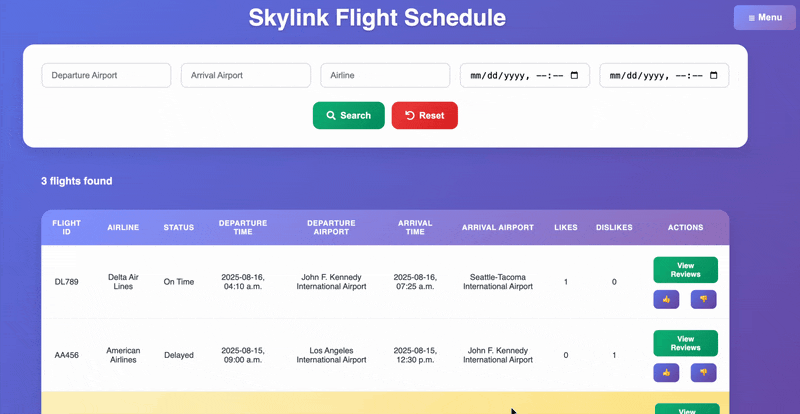
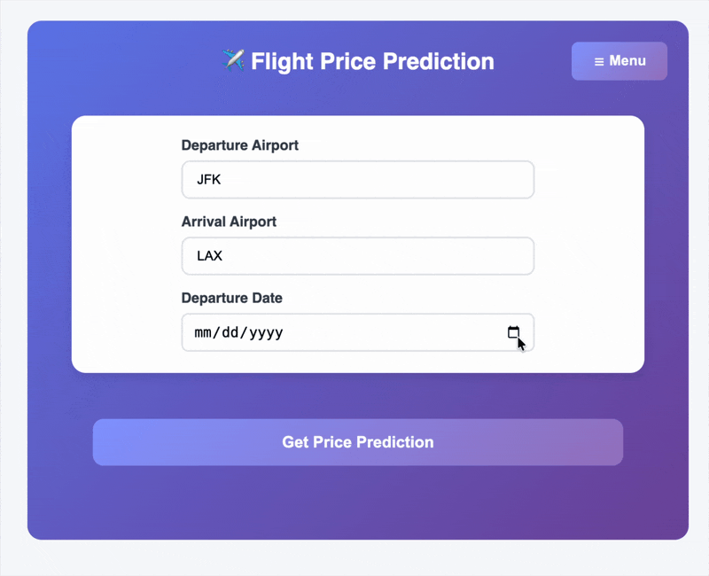
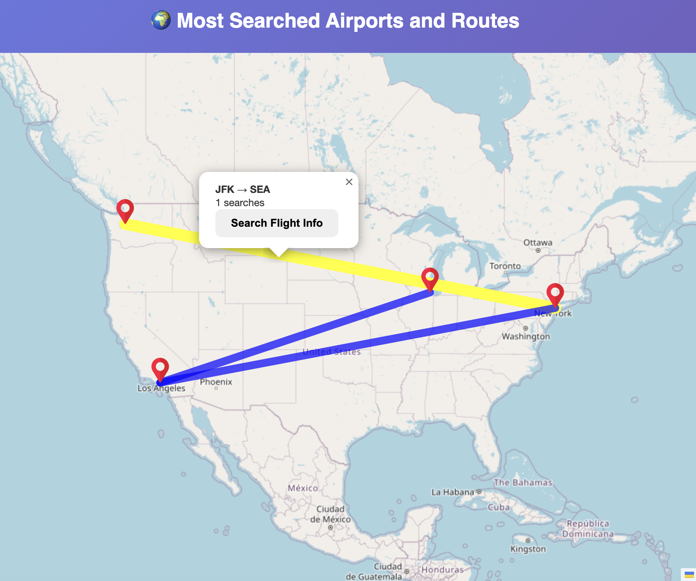
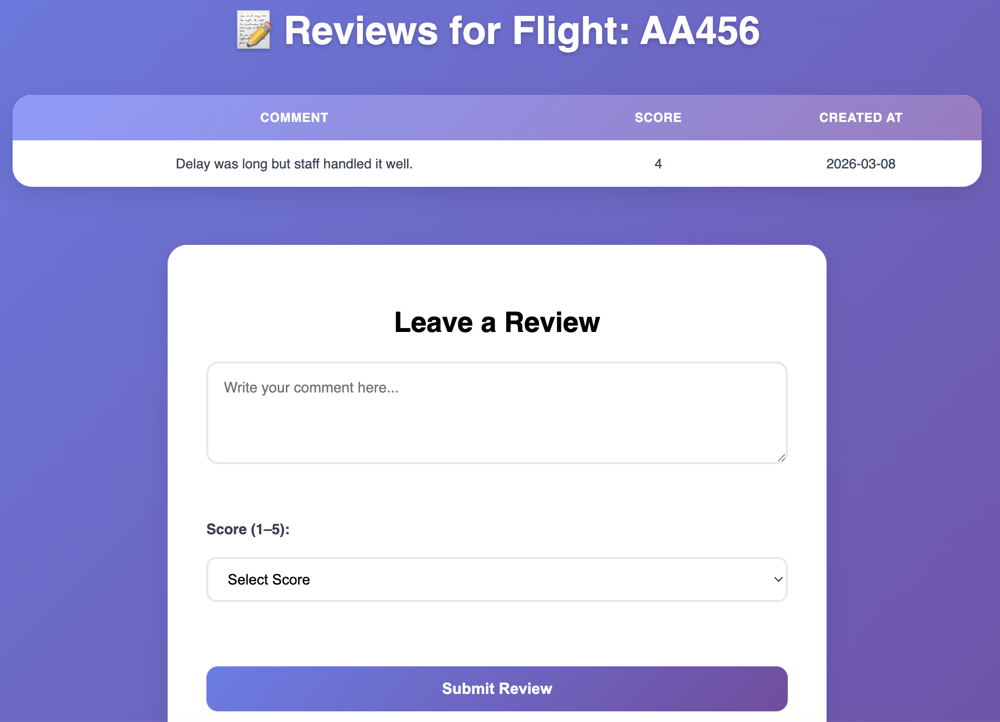

# Flight Dashboard

Full-stack microservices application for flight search and AI-powered price prediction. Built with React, Node.js, Python Flask, deployed on Kubernetes.

## Demo

| Flight Search | AI Price Prediction |
|---|---|
|  |  |

| Popular Routes | Flight Reviews |
|---|---|
|  |  |

## Features

- **Flight Search** – Search flights by departure, arrival, airline, and date range.
- **AI Price Prediction** – Rule-based price estimate adjusted by a GPT-3.5 market multiplier, 65-98% confidence based on booking lead time
- **Popular Routes Tracking** – Records and ranks frequently searched routes.
- **User Accounts** – Secure login with Redis sessions.
- **Flight Reviews** – Users can leave comments and ratings for flights.
- **Autocomplete Search** – Airport search with instant suggestions.
- **Responsive Design** – Works on desktop, tablet, and mobile.

## Tech Stack

- **Frontend**: React, Vite, CSS
- **Backend**: Node.js, Express, MySQL, Redis
- **ML Service:** Python, Flask, OpenAI GPT-3.5  
- **DevOps:** Docker, Kubernetes, Nginx

## Project Structure
```
flight-dashboard/
├── client/               # React frontend
│   ├── src/
│   ├── Dockerfile
│   └── nginx.conf
├── server/              # Node.js backend
│   ├── routes/
│   ├── database/
│   └── middleware/
├── ml-service/          # Python ML service
│   ├── app.py
│   ├── Dockerfile
│   └── requirements.txt
├── k8s/                 # Kubernetes manifests
│   ├── *.yaml
│   └── secret.yaml      # Template only
├── docker-compose.yml
└── README.md
```

## Local Development

1. **Clone the repository**
   ```bash
   git clone https://github.com/yvonneyihan/flight-dashboard.git
   cd flight-dashboard

2. **Install dependencies**
   ```bash
   npm install
   cd client && npm install && cd ..
   cd ml-service && python3 -m venv venv && source venv/bin/activate && pip install -r requirements.txt && cd ..

3. **Database setup**
   Create a MySQL database.
   The database name is customizable. Replace skylink with your own name everywhere (in SQL and .env)
   Run the schema and sample data:
   ```bash
   mysql -u root -p -e "CREATE DATABASE skylink;"
   mysql -u root -p skylink < server/database/schema.sql
   mysql -u root -p skylink < server/database/sample_data.sql

5. **Start backend + frontend**
   ```bash
   npm run dev

6. **Start ML Service**
   ```bash
   cd ml-service
   source venv/bin/activate
   python app.py

7. **Open the app at http://localhost:5173**

## Testing

| Service | Framework | Status |
|---|---|---|
| Backend (`server/`) | Jest + Supertest | ✅ Done |
| Frontend (`client/`) | Vitest + React Testing Library | ✅ Done |
| ML Service (`ml-service/`) | pytest | ✅ Done |
| CI (GitHub Actions) | — | 🔜 Planned |

**Backend** — MySQL and Redis are mocked (`__mocks__/`), so no real database is needed to run these:

```bash
npm test
```

Covers:
- `GET /health` and `/health/detailed` (including database/Redis failure branches)
- `POST /api/predictions/price` (validation, successful prediction, ML-service outage handling)
- `GET /api/users/autocomplete` (blank query, matching results, database error handling)

**Frontend** — from `client/`:

```bash
npm test
```

Covers:
- `AutocompleteInput` (fetch threshold, rendering suggestions, selection, failed-fetch handling)
- `Home` page (renders without crashing, flight data loads and displays correctly)

**ML Service** — from `ml-service/` (with the venv activated), OpenAI calls are mocked so no real API calls or costs are incurred:

```bash
pytest
```

Covers:
- `/health` endpoint
- `/predict` validation (missing fields, invalid date, past date)
- Rule-based vs. hybrid-AI prediction paths, including confidence scoring
- `calculate_rule_based_price` and `get_ai_market_insights` as isolated unit tests (including the multiplier safety clamp and API-failure fallback)

## Deploy to Kubernetes

1. **Clone the repository**
   ```bash
   git clone https://github.com/yvonneyihan/flight-dashboard.git
   cd flight-dashboard

2. **Build Docker images**
   ```bash
   docker build -t flight-frontend:latest ./client
   docker build -t flight-backend:latest .
   docker build -t flight-ml-service:latest ./ml-service

3. **Deploy to Kubernetes**
   ```bash
   kubectl apply -f k8s/namespace.yaml
   kubectl apply -f k8s/configmap.yaml

4. **Create secrets (don't commit!)**
   ```bash
   kubectl create secret generic flight-secrets -n flight-dashboard \
     --from-literal=DB_PASSWORD='your_password' \
     --from-literal=OPENAI_API_KEY='your_key' \
     --from-literal=SESSION_SECRET='random_secret'

5. **Deploy services**
   ```bash
   kubectl apply -f k8s/mysql-pvc.yaml
   kubectl apply -f k8s/mysql-init.yaml
   kubectl apply -f k8s/mysql.yaml
   kubectl apply -f k8s/redis.yaml
   kubectl apply -f k8s/ml-service.yaml
   kubectl apply -f k8s/backend.yaml
   kubectl apply -f k8s/frontend.yaml

4. **Wait for pods to be ready**
   ```bash
   kubectl get pods -n flight-dashboard -w

5. **Access application**
   ```bash
   kubectl port-forward -n flight-dashboard svc/frontend 8080:80
   
6. **Open at http://localhost:8080**
